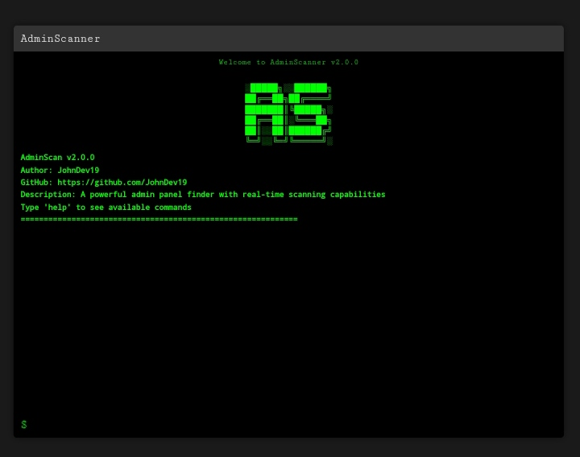
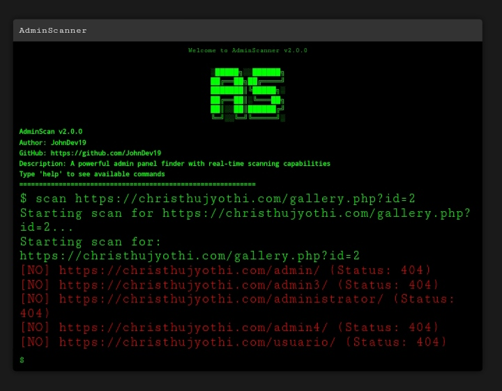

# AdminScanner v2.0

AdminScanner is a web-based administrative panel finder tool designed for security researchers and penetration testers. This interactive terminal-based tool enables real-time scanning for admin panels on web applications, helping users locate and assess vulnerabilities in administrative interfaces.




## Features

- 🔎 **Real-Time Scanning**: Supports continuous scanning and displays results as they are discovered.
- ⚙️ **Configuration Options**: Customize scan settings like `scanDelay`, `maxRetries`, `timeout`, and more.
- 📌 **Command History**: Navigate through previous commands using the up/down arrow keys.
- 🔐 **Export Results**: Save scan results as a JSON file.
- ⌛ **Progress Bar**: Visual indicator for scan progress.
- 🖼️ **ASCII Art and Intro**: Aesthetic intro and ASCII art display on launch.
- 💻 **Verbose Mode**: Toggle detailed logging for enhanced debugging.

## Table of Contents
- [Getting Started](#getting-started)
  - [Requirements](#requirements)
  - [Installation](#installation)
  - [Configuration](#configuration)
- [Commands](#commands)
  - [Available Commands](#available-commands)
- [Configuration Options](#configuration-options)
- [Error Handling](#error-handling)
- [Usage](#usage)
- [License](#license)

---

## Getting Started

### Requirements
- **Modern Browser**: Chrome, Firefox, Safari, or Edge
- **Node.js & npm** (optional, if serving locally)

### Installation

1. **Clone the Repository**:
   ```bash
   git clone https://github.com/JohnDev19/AdminScanner.git
   cd AdminScanner
   ```

2. **Open `index.html` in Your Browser**:
   No installation is needed if you are using it in a browser. Just open `index.html` to start the application.

3. **Optional: Local Server**:
   To run locally with a server:
   ```bash
   npm install -g serve
   serve .
   ```

### Configuration

In `terminal.js`, the `config` object contains default values for the tool. You can adjust the settings within this file or modify them during runtime using the `set` command.

---

## Commands

AdminScanner includes a range of commands for managing scans, viewing configurations, and navigating command history. Enter commands directly in the command input field.

### Available Commands

- **help**: Displays a list of all available commands.
- **scan `<url>`**: Starts a scan on the specified URL.
- **stop**: Stops the current scan if active.
- **clear**: Clears the terminal screen.
- **history**: Shows a list of previously executed commands.
- **about**: Provides information about AdminScanner.
- **config**: Shows the current configuration settings.
- **set `<option>` `<value>`**: Adjusts a configuration option. Example: `set scanDelay 200`
- **export**: Exports the scan results to a JSON file.
- **verbose**: Toggles verbose mode on or off.
- **reset**: Resets configuration settings to their default values.

---

## Configuration Options

Modify AdminScanner settings directly in `terminal.js` in the `config` object or by using the `set` command during runtime:

| Option       | Default Value | Description                                       |
|--------------|---------------|---------------------------------------------------|
| `scanDelay`  | `100`         | Delay between each scan request (in ms).          |
| `maxRetries` | `3`           | Number of retries if a request fails.             |
| `timeout`    | `5000`        | Timeout for each request (in ms).                 |
| `userAgent`  | `AdminScanner/2.0` | Custom user agent string for the scanner.  |
| `verbose`    | `false`       | Enables detailed logging for each scan.           |
| `maxDepth`   | `3`           | Maximum recursion depth for scanning.             |
| `threads`    | `5`           | Number of concurrent threads for the scan.        |
| `saveResults`| `true`        | Enable or disable result-saving to JSON.          |

---

## Error Handling

AdminScanner gracefully handles errors to ensure a smooth user experience. Common errors include:

- **AbortError**: Indicates that a scan was manually stopped.
- **Network Errors**: Shows a descriptive error message when connection issues occur.
- **Configuration Errors**: Displays a message when trying to set an invalid configuration option.

For debugging, toggle `verbose` mode (`verbose` command) to view detailed logs.

---

## Usage

1. **Launching the Application**:
   Open `index.html` in your browser to start the AdminScanner tool. The ASCII art and intro text will display on load.

2. **Running a Scan**:
   - Enter `scan <url>` to initiate a scan on a specific URL.
   - Progress will display via the progress bar.

3. **Modifying Configuration**:
   - Use `set <option> <value>` to change configuration settings during runtime.
   - Example: `set scanDelay 200` will change the scan delay to 200ms.

4. **Exporting Results**:
   - After a scan, use the `export` command to save results as a JSON file.
   - The exported file will download automatically as `scan-results-[timestamp].json`.

5. **Stopping a Scan**:
   - If a scan is in progress, type `stop` to terminate it.

---

## License

This project is licensed under the MIT License - see the [LICENSE](LICENSE) file for details.
